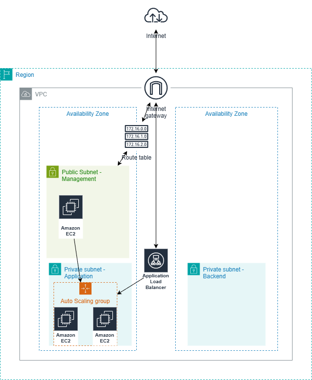
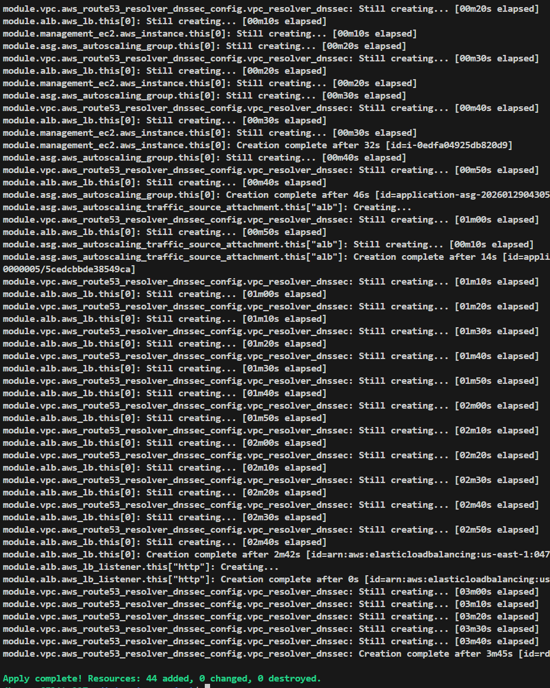

# Intro

This repository is for a VPC architecture project with 4 subnets across multiple availability zones built using terraform. It was designed to meet Coalfire's minimum requirements.
Modules from Terraform and Coalfire's repo were used in this project.

# Analysis

## Security

Depending on how the infrastructure will be used and the data that it stores there are different levels of security requirements and AWS has a number of services we can use to keep our data secure.
The infrastructure uses security groups and private subnets to add some security. Security groups work at the instance level. However, this is minimal security. Below are some ways we could increase security.

* It does not have a custom NACL (Network Access Control List) explicitly configured which would add extra security at the subnet level by adding traffic rules.
* A WAF (Web Application Firewall) could be applied to the ALB (Application Load Balancer) to help filter traffic. [What is AWS WAF?](https://aws.amazon.com/waf/)
* AWS Shield could also be used to help protect the ALB from DDoS (Distributed Denial of Service).
* IAM roles should be created and assigned with following the principle of least privilege.
* Create an IAM User who will have access and enforce MFA (Multi Factor Authentication).
* Use Amazon GuardDuty for threat detection. [What is Amazon GuardDuty?](https://docs.aws.amazon.com/guardduty/latest/ug/what-is-guardduty.html) 
* Although currently there aren't any credentials the Terraform variables should be set to sensitive = true if they hold any sensitive data so it does not get stored as plain text in the state file.

## Availability

This infrastructure is configured to use 4 subnets across 2 availability zones with an auto scaling group (ASG) which will keep 2 EC2 instances running as a minimum. A health check has been added to the ALB to help maintain EC2s available. There are a few things that could help increase availability. 

* The amount of subnets could be increased to have an extra application subnet.
* If this is hosting a web application then CloudFront could be used for content delivery using edge locations. [What is CloudFront?](https://docs.aws.amazon.com/AmazonCloudFront/latest/DeveloperGuide/Introduction.html)

## Cost Optimization

I tried to use as much of the free services AWS provides to keep costs down. We could bring the costs down a bit by bringing down the minimum amount of EC2 the ASG keeps running from 2 to just 1 instance. There are also other instance types that could be used depending on how the infrastructure is planned to be used. There are spot instances and even dedicated instances. Spot instances offer big discounts but there are downsides like price fluctuation, complex management, and interruption risks. [What are spot instances?](https://docs.aws.amazon.com/AWSEC2/latest/UserGuide/using-spot-instances.html)
Services like AWS Trusted Advisor can also be used to help reduce costs.

## Shortcomings

Below are some shortcomings in this infrastructure configuration

* Currently the Terraform state file will be saved locally. A backend.tf should be created and configured to store the state file on a remote service like an S3 bucket with DynamoDB for state locking.
* The only monitoring in place is the health check on the ALB and flow logs from the VPC module. For better monitoring services like AWS CloudWatch and AWS CloudTrail. There are a few other monitoring services listed in the previous sections.
* Security should be improved.
* There are some module restrictions which do not allow the usage of the latest version of the AWS provider.

# Improvement Plan

## List of possible improvements

* Add a database service to the backend subnet to connect to the application subnet.
* Add a S3 bucket with versioning enabled to store the Terraform state file.
* Set up DynamoDB for state locking in case there are multiple people working on this.
* Add monitoring services with some lambda functions to help with management.
* Add custom NACLs to all the subnets for better network security.
* Remove the default values in the variables and encourage the use of terraform.tfvars file
* Add AWS Web Application Firewall and AWS Shield
* Create IAM roles

## Priorities in which to implement improvements

* Security is always at the top of my list. I would start by configuring NACLs, adding the WAF, AWS Shield, and creating and assigning IAM roles to all the services.
* Set up the monitoring services for both security and computing performance.
* Set up the S3 bucket and DynamoDB to store and lock the Terraform state file.
* Remove Terraform variables' default values
* Add a database to the backend subnet with a security group and set it to be able to communicate with the application subnet.

# Extra Notes

## How to restore data if the S3 bucket was deleted?

* Check for backups.
* If the S3 bucket had versioning enabled, restore the previous version. This will help restore most of the data. [Restoring previous versions](https://docs.aws.amazon.com/AmazonS3/latest/userguide/RestoringPreviousVersions.html)
* If backups and versioning are not an option then the data is lost.

## How to respond to an EC2 outage?

* Verify that the EC2 instance is running.
* Check the monitoring tools like AWS Health Dashboard.
* Restart the instance.
* If everything fails then replace the instance.

## How to deploy?

* Check the section below for help installing what you need like terraform or git if you don't already have it installed.
* With git installed you can clone the repository by running    git clone https://github.com/jburg379/interview-project
* Once the repository is cloned you can either create a terraform.tfvars file to add values for the variables which can be found in the variables.tf file this is optional since there are default values except for one variable.
* There are steps below on how to connect to your AWS account.
* Once you are ready run  terraform init.
* There is 1 variable that does not have a default value. You will be asked to provide the value when you run the next commands. The variable is for the IP (format x.x.x.x/x) that will have access to the EC2 on the public subnet.
* Then run terraform plan (this can be skipped if you want since terraform apply will show you the plan first and then ask for verification but I recommend running this first anyway).
* Finally run terraform apply (when prompted to either confirm or deny).

# Assumptions

* I assumed the person who wants to deploy this environment wants to use the Coalfire VPC module.
* Just need a quick environment to run with minimal configuration.
* Is planning on using the backend subnet for a database which will be manually created and imported into Terraform later.
* Wanted the ALB to have a health check configured to at least have some level of monitoring for the ASG.
* The person deploying this might have never installed Terraform or git.
* A different team will probably configure the IP that will have access to the EC2 on the management subnet.

# Diagram

# Evidence of successful deployment

## Prerequisites

Below are some of the things you will need to provision the infrastructure. The links will provide extra help and information.

* Git - this is a free open source distributed version control system. [How to install git](https://git-scm.com/install/linux)
* Terraform - this is an open source infrastructure as code software tool used to provision and manage cloud and on-prem resources. [What is Terraform?](https://developer.hashicorp.com/terraform/intro)
* [How to install Terraform](https://developer.hashicorp.com/terraform/tutorials/aws-get-started/install-cli)
* AWS Account and credentials to create resources in the us-east-1 region. [Create an AWS account](https://aws.amazon.com/console/)
* Use the AWS CLI to configure your AWS credentials. You will need AWS access key ID and Secret Access key
* [How to install AWS CLI](https://docs.aws.amazon.com/cli/latest/userguide/getting-started-install.html)
* [Help to connect terraform with AWS](https://dev.to/aws-builders/connecting-aws-with-terraform-a-short-guide-4bda)

## Requirements

| Name | Version |
|------|---------|
|  [aws](#requirement\_aws) | ~> 5.85 |
|  [local](#requirement\_local) | ~> 2.0 |
|  [tls](#requirement\_tls) | ~> 4.0 |

## Providers

| Name | Version |
|------|---------|
|  [aws](#provider\_aws) | 5.100.0 |
|  [local](#provider\_local) | 2.6.1 |
|  [tls](#provider\_tls) | 4.1.0 |

## Modules

| Name | Source | Version |
|------|--------|---------|
|  [alb](#module\_alb) | terraform-aws-modules/alb/aws | 9.13.0 |
|  [alb\_sg](#module\_alb\_sg) | terraform-aws-modules/security-group/aws | 5.3.1 |
|  [application\_sg](#module\_application\_sg) | terraform-aws-modules/security-group/aws | 5.3.1 |
|  [asg](#module\_asg) | terraform-aws-modules/autoscaling/aws | 8.3.1 |
|  [management\_ec2](#module\_management\_ec2) | terraform-aws-modules/ec2-instance/aws | 5.8.0 |
|  [management\_sg](#module\_management\_sg) | terraform-aws-modules/security-group/aws | 5.3.1 |
|  [vpc](#module\_vpc) | git::https://github.com/Coalfire-CF/terraform-aws-vpc-nfw.git | v3.1.0 |

## Resources

| Name | Type |
|------|------|
| [aws_internet_gateway.igw](https://registry.terraform.io/providers/hashicorp/aws/latest/docs/resources/internet_gateway) | resource |
| [aws_key_pair.project](https://registry.terraform.io/providers/hashicorp/aws/latest/docs/resources/key_pair) | resource |
| [aws_route.management_route](https://registry.terraform.io/providers/hashicorp/aws/latest/docs/resources/route) | resource |
| [aws_route_table.management_rt](https://registry.terraform.io/providers/hashicorp/aws/latest/docs/resources/route_table) | resource |
| [aws_route_table.private](https://registry.terraform.io/providers/hashicorp/aws/latest/docs/resources/route_table) | resource |
| [aws_route_table_association.application](https://registry.terraform.io/providers/hashicorp/aws/latest/docs/resources/route_table_association) | resource |
| [aws_route_table_association.backend](https://registry.terraform.io/providers/hashicorp/aws/latest/docs/resources/route_table_association) | resource |
| [aws_route_table_association.management](https://registry.terraform.io/providers/hashicorp/aws/latest/docs/resources/route_table_association) | resource |
| [local_file.project_key](https://registry.terraform.io/providers/hashicorp/local/latest/docs/resources/file) | resource |
| [tls_private_key.project](https://registry.terraform.io/providers/hashicorp/tls/latest/docs/resources/private_key) | resource |

## Inputs

| Name | Description | Type | Default | Required |
|------|-------------|------|---------|:--------:|
|  [ami\_id](#input\_ami\_id) | aws linux ami for the EC2 instances | `string` | `"ami-0532be01f26a3de55"` | no |
|  [aws\_region](#input\_aws\_region) | AWS region to deploy resources | `string` | `"us-east-1"` | no |
|  [custom\_ip](#input\_custom\_ip) | IP address to ssh to the management EC2 | `string` | n/a | yes |
|  [instance\_type](#input\_instance\_type) | instance type for the EC2 instances | `string` | `"t2.micro"` | no |
|  [key\_name](#input\_key\_name) | key name for the aws key pair | `string` | `"project"` | no |

## Outputs

No outputs.
